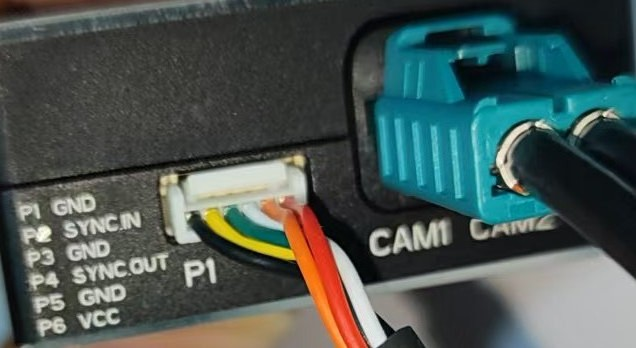
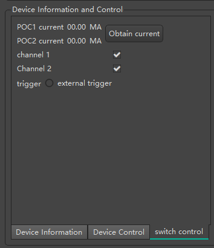

# SensingCaptureV3 User Manual

## Introduction

SensingCaptureV3 is a Windows-based PC software designed for Panda (UVC Tool) by Sensing TECH CO.,LTD.  

It is primarily used for:

- Upgrade firmware for SENSING gmsl cameras
- Readout pre-calibrated intrinsic parameters stored in the cameras's non-volatile memory
- Camera configuration

SensingCaptureV3 communicates with Panda via USB connection.

System Requirements

| Component | Specification          |
| :-------- | :--------------------- |
| OS        | Windows 10/11 (64-bit) |
| USB       | 3.0+ Type-A port       |

## Panda Overview

Panda is a uvc device which provides a communication interface between the PC and SENSING gmsl cameras. 

  

## Device Connection

1. **USB Connection**

   - Connect Panda to PC via USB cable

2. **Camera Connection**
   - Connect Camera to Panda via gmsl coax cable

   

     
   

## Connector Pin Definition

There is an additional connector interface on the side of Panda device, which contains the following functional pins

- **P1, P3, P5** :  GND

  - Ground
  - When daisy-chaining multiple Panda devices, ensure all GND pins are connected to common grounding

- **P2** : SYNC IN

  - Frame sync input pin
  - When using External Trigger Mode, this pin forwards frame sync signal directly to the max9296's MFP7 pin (max9296 is the deserializer inside Panda)

- **P4** : SYNC OUT

  - Frame sync output pin
  - Output frame sync signal (3.3v pulse) internally generated by Panda which can be enabled via configuration by SensingCaptureV3

  - This pin is used for multi cameras frame sync when using multi Panda devices

    1. Select a Panda device and config it as master via SensingCaptureV3
    2. Config the other Panda devices as slave via SensingCaptureV3
    3. Connect all slave Panda's P2 pin to P4 pin of master Panda

    | Connection                          | Purpose                    |
    | :---------------------------------- | :------------------------- |
    | Master P4 `SYNC.OUT` → Slave P2 `SYNC.IN` | Time-sync multiple cameras |
    | Shared GND (P1/P3/P5)               | Prevent ground loops       |

  

## How To Use SensingCaptureV3

1. **Download the Software**
   - Obtain the latest version of SensingCaptureV3 host software for your Windows PC.
2. **Install Required Libraries**
   - Navigate to the `packages` folder in the software directory.
   - Install all prerequisite libraries before first use.
3. **Launch the Application**
   - Double-click `sensingCaptureV3.exe` to start the program.
   - *Note:* Connected Panda devices will automatically appear in the Device List section.

 **Interface Overview**

Upon successful launch, the main interface will display as shown below:

**Key Features:**

- Language Selection: Choose between English or Chinese via the dropdown menu.
- Device Status: Verify Panda box connection status in the Device List panel.

The Device Control Interface (shown below) provides I²C register access functionality:

  

The Power Control interface (shown below) allows you to:

- Read module current in real-time
- Enable/disable POC (Power-over-Coax) power to the module

  

       

###  5 Basic Software Functions

##### 5.1 **Firmware Upgrade**

To upgrade the firmware of your camera: 

1. Go to Tools > Camera Firmware Upgrade in the top menu.

2. In the Choose ISP Version dropdown, select the correct camera ISP type.

3. Click Confirm to close the window, and then reopen it to access the firmware upgrade interface.

4. In the firmware upgrade window, select the firmware file you wish to upgrade, and enter the camera's serial number (this is found on the camera's label).

5. Click Start Update to begin the firmware upgrade process.

   For additional details on the firmware upgrade, refer to the GW5 and Sony Firmware Upgrade documents in the Document folder.

##### 5.2 **Device I2C Switching**

To switch between I2C address modes:

1. Navigate to Tools > Device I2C Switching in the top menu.
2. You will need to connect the micro usb cable to PC and switch to MCU mode
   - Before upgrading firmware, make sure the camera is in MCU mode.
   - For normal operation (reading/writing registers), keep it in USB mode.

##### 5.3 **Register Read/Write**

To read or write to the camera registers:

1. Get into the Device Control table
2. In the I2C Address input field, enter the desired I2C address (8-bit format). Note that a 7-bit address must be shifted left by 1 bit.
3. In Register Address Width, select the width for the register address (either 8-bit or 16-bit).
4. Enter the register address you want to read or write in the Register Address field.
5. In the Read - Write Sequence dropdown, select the desired sequence (MSB-first or LSB-first).
6. Choose the Register Value Width (8-bit or 16-bit).
7. In the Register Value field, enter the value to be read or written.
   - If you are reading, click the Read button. If successful, the value will be displayed.
   - If you are writing, click the Write button to send the value to the register.

##### 5.4 **Load Configuration Parameters**

 To configure the camera for normal operation:

1. Load the configuration to initialize the sensor, serializer, and deserializer.
2. The software will retrieve image formats and resolution settings, which need to be correctly configured for proper image capture.

To load a configuration:

1. Click the Load Configuration button to open the configuration window.
2. From the Configuration File dropdown, select the desired configuration. You can also use the fuzzy search feature to quickly locate the configuration you need.
3. If the built-in configuration file does not open correctly, use the Manual Loading button to load the configuration manually.

Once the configuration is loaded:

1. Use the Turn On button to start the video stream.
2. Use the Turn Off button to stop the video stream.

You can also view the current settings by selecting Device Information from the menu.

##### 5.5 **Measuring Module Current**

1. Navigate to the Power Control interface
2. Click Get Current to display real-time current draw
3. Interpret the reading:
   - *Normal operation*: Current within specified range (refer to device specifications)
   - *Abnormal conditions*:
     - 0mA: No power/connection failure
     - Overcurrent: Potential short circuit

*Note: Current monitoring helps estimate:*

- Module operational status
- Power consumption (P = V×I)

#####  5.6 Power Switching Control

1. Locate the target channel in the interface
2. Toggle power using the checkbox:
   - ✅ Checked: Power ON (12V POC enabled)
   - ☐ Unchecked: Power OFF

For detailed information, please visit the official website:https://www.sensing-world.com/.

For additional technical support, please contact :Technical Support<<Support@sensing-world.com>>

